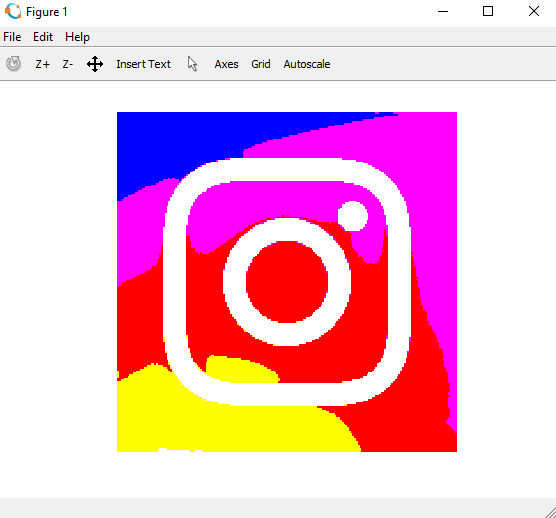
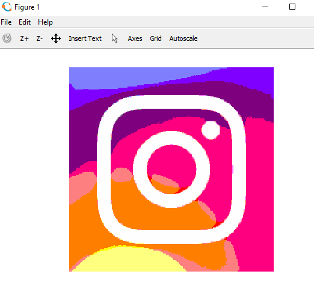
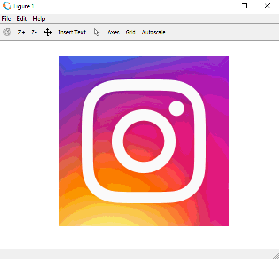
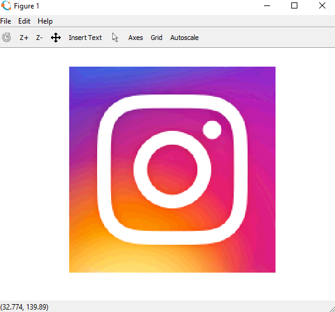

# MATLAB-Image-Reduce

### Image Processing

Reduce the no. of RGB intensities in a color Image.
--------
* Reduce function reduce the number of intensities of each Red, Green & Blue in an image to the required value. 
* I have not counted 0 intensity in RGB.

### Original Image 

### Allow only 1 intensity of Red, Green & Blue each (255 only)
This is same as threshold. www.github.com/thisisnsh/matlab-image-threshold

### Allow 2 intensity of Red, Green & Blue each (128 & 255 only)

### Allow 10 intensity of Red, Green & Blue each 

### Allow 25 intensity of Red, Green & Blue each

